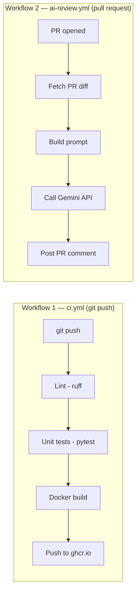

# 🤖 Auto PR Review — AI-Powered CI/CD Pipeline

> A GitHub Actions pipeline that automatically reviews every pull request using **Gemini 2.0 Flash**, flags bugs and security risks, and posts the review as a PR comment — at zero cost.

---

## ✨ What this project does

This repo contains two GitHub Actions workflows:

| Workflow | Trigger | What it does |
|---|---|---|
| `ci.yml` | Every push to `main` | Lint → Test → Build Docker image → Push to GHCR |
| `ai-review.yml` | Every pull request | Fetch diff → Send to Gemini → Post AI review as PR comment |

The app itself is a small Flask todo API — it exists only as a target for the pipeline to lint, test, and containerize.

---

## 🏗️ Architecture

**Data flow for the AI reviewer:**
